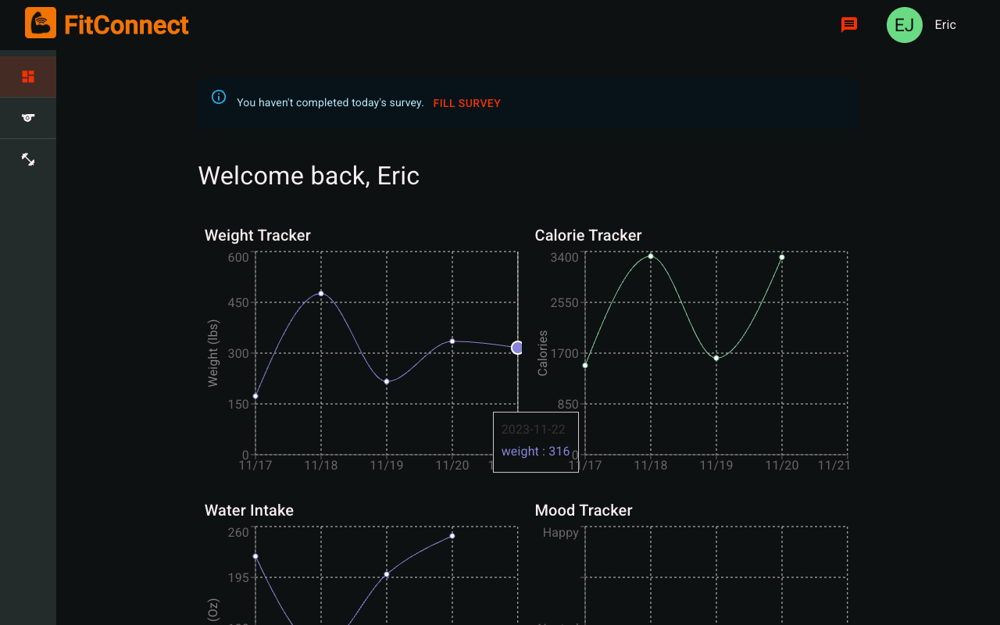
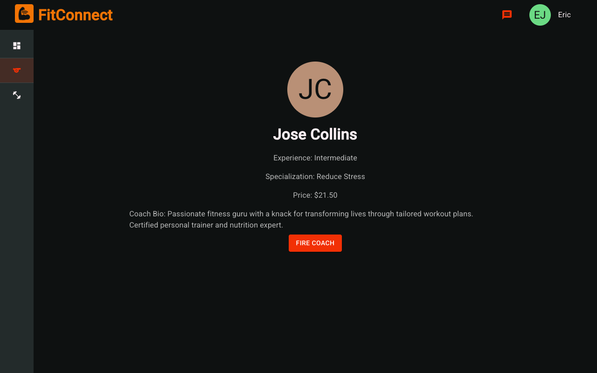
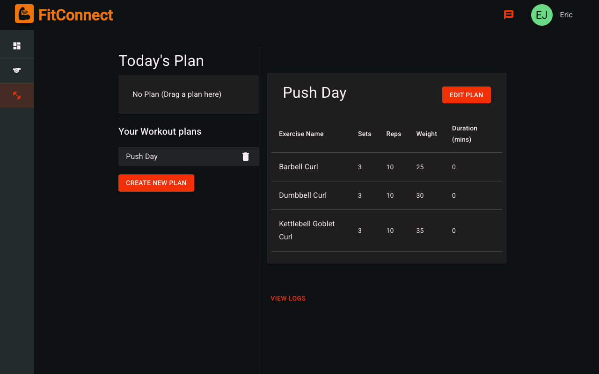
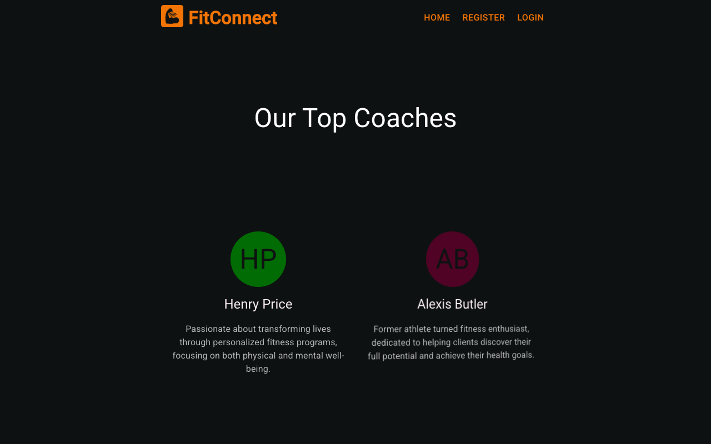
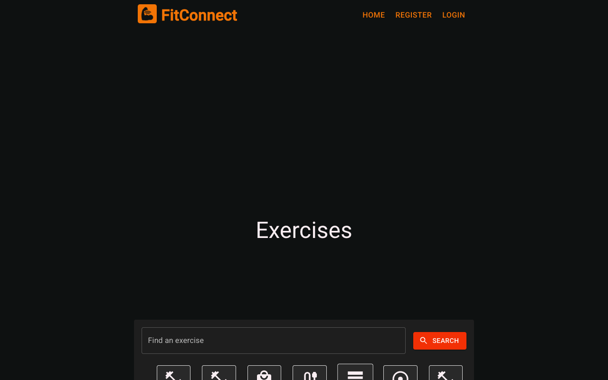

# FitConnect

A full-stack fitness platform for connecting members with personal coaches — build workout
plans, track daily health metrics, and message your coach, all in one place.

**Stack:** Django REST Framework + MySQL backend, React (Create React App) + Material UI frontend.


## Features

**For members**
- Browse and hire coaches, filtered by goal, experience, and price
- Build custom workout plans from a searchable exercise bank (filter by muscle group / equipment)
- Track a daily plan with drag-and-drop, log sets/reps/weight per exercise
- Daily survey covering weight, calories, water intake, and mood, visualized as trend charts
- Direct messaging with your coach

**For coaches**
- Accept/decline incoming client requests
- View and manage each client's workout plans
- Build workout plans on a client's behalf

**For admins**
- Approve/decline "become a coach" applications
- Manage the shared exercise bank

## Screenshots

| Home | Dashboard |
|---|---|
|  |  |

| Find a Coach | Workout Plan |
|---|---|
|  |  |

| Coaches Section | Exercise Bank |
|---|---|
|  |  |

## Getting started

These steps are what was actually run and verified locally (macOS, Apple Silicon).

### Prerequisites

- Python 3.9+
- Node **16.x** (the frontend's `react-scripts` version is too old to run on newer Node — see
  [Known limitations](#known-limitations)). If you use [nvm](https://github.com/nvm-sh/nvm),
  `frontend/.nvmrc` pins this for you: run `nvm use` from `frontend/`.
- MySQL 8.x, if you want to run against MySQL. Otherwise you can skip straight to the SQLite
  fallback below — no DB server needed.

### Backend

```bash
cd backend
python3 -m venv .venv
source .venv/bin/activate
pip install -r requirements.txt
```

Create your local env file:

```bash
cp .env.example .env
```

Generate a real `SECRET_KEY` and drop it into `.env`:

```bash
python -c "import secrets; print(secrets.token_urlsafe(50))"
```

**Fastest path (SQLite, no DB server required):** leave `USE_SQLITE=True` in `.env` (this is the
default in `.env.example`).

**Closer to production (MySQL):** set `USE_SQLITE=False` in `.env`, fill in `DB_NAME` /
`DB_USER` / `DB_PASSWORD` / `DB_HOST` / `DB_PORT`, and create the schema first:

```bash
mysql -u root -p -e "CREATE SCHEMA IF NOT EXISTS fitness;"
```

Then, either way:

```bash
python manage.py makemigrations FitConnect
python manage.py migrate
python manage.py loaddata dumpeddata.json   # seeds coaches, exercises, and demo users
python manage.py runserver
```

The API is now up at `http://localhost:8000/`.

### Frontend

In a separate terminal:

```bash
cd frontend
nvm use            # picks up Node 16.x from .nvmrc, if you use nvm
cp .env.example .env
npm install
npm start
```

The app opens at `http://localhost:3000/` and talks to the backend via
`REACT_APP_API_BASE_URL` in `frontend/.env`.

## Project structure

```
backend/    Django REST API (FitConnect app + FitConnectProjectDjango project settings)
frontend/   React app (Create React App, MUI, react-router, axios)
```

## Known limitations

- **Frontend requires Node 16.** `react-scripts@2.1.3` (2018) depends on `webpack-dev-server`
  packages that call a Node internal API (`process.binding('http_parser')`) removed in later
  Node versions — `npm start` crashes immediately on Node 18+. Upgrading `react-scripts` to a
  current major version would fix this properly, but it's a large jump (CRA2 → CRA5, webpack 4 →
  5) that risks breaking a lot of components; pinning Node 16 via `.nvmrc` was the lower-risk
  fix for now.
- **Stripe packages are installed but unused.** `@stripe/react-stripe-js` and `@stripe/stripe-js`
  are in `frontend/package.json` but there's no Stripe integration wired up anywhere in the code
  yet — likely scaffolding for a future payments feature.
